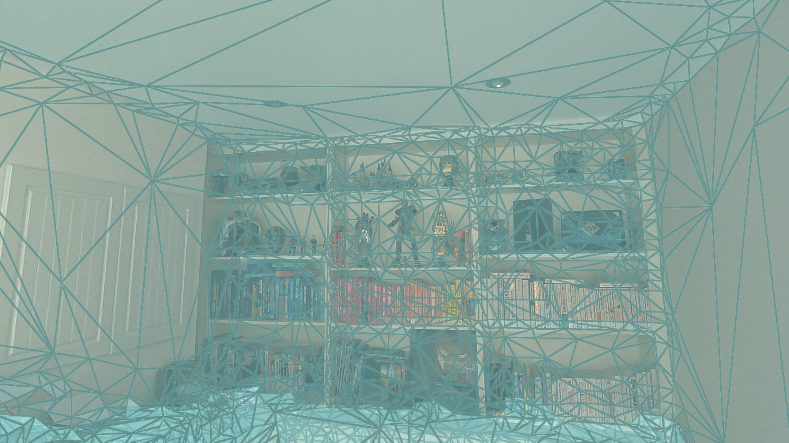
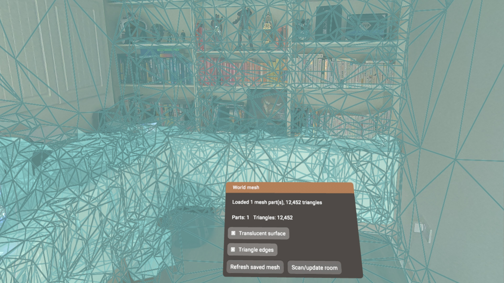
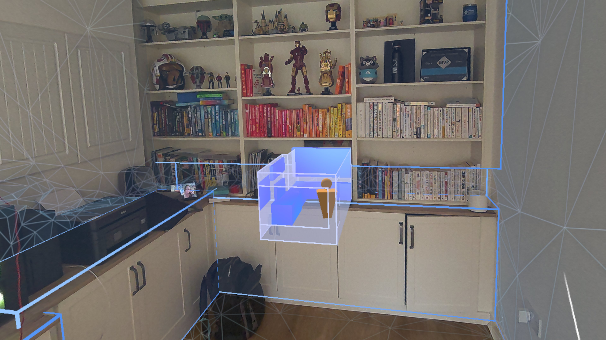
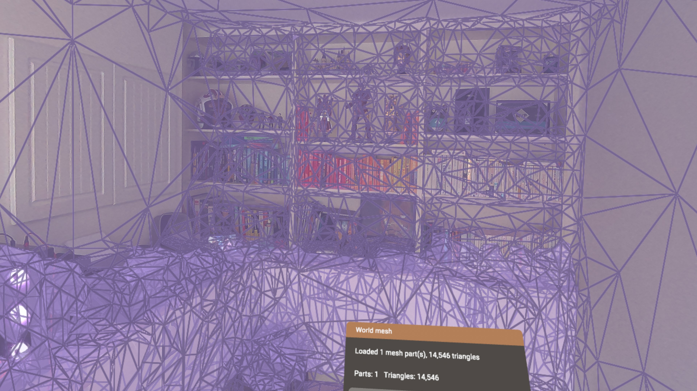

# StereoKit Scene Mesh

A small [StereoKit](https://stereokit.net/) sample that loads the room mesh saved on a Meta Quest and renders it as regular StereoKit geometry. It also enables passthrough so you can compare the reconstructed mesh with the physical room around you. From inside the app, users can seamlessly launch Meta's native Space Setup scanning experience to re-scan or update their room; when they return, the sample automatically loads the refreshed mesh.

The sample uses Meta's OpenXR scene APIs directly from C#:

- `XR_FB_scene` and `XR_FB_scene_capture` to find or update the saved room
- `XR_META_spatial_entity_mesh` to retrieve triangle-mesh data
- `XR_FB_passthrough` to display the camera passthrough layer

## What it does

- Requests access to the Quest scene model.
- Finds the saved room and loads its triangle mesh.
- Converts each mesh part into a StereoKit `Mesh`.
- Keeps mesh parts aligned with their OpenXR spatial anchors.
- Shows either a translucent surface, triangle edges, or both.
- Seamlessly hands off to Meta's native Space Setup flow to re-scan or update the room, then reloads the updated mesh on return.

## Screenshots

| Mesh overlay in passthrough | Mesh controls and scan action |
| --- | --- |
|  |  |

| Meta room re-scan experience | Alternate mesh overlay |
| --- | --- |
|  |  |

## Requirements

- A Meta Quest headset with passthrough and Scene API support
- A room captured in **Settings > Physical Space > Space Setup** (the app can also open this flow)
- [.NET 9 SDK](https://dotnet.microsoft.com/download/dotnet/9.0)
- The .NET Android workload and an Android SDK for headset builds
- Developer mode and USB debugging enabled on the headset for local deployment

This repository references StereoKit `0.3.11`. The world-mesh functionality is specific to the Meta OpenXR runtime; on an unsupported runtime, the app still starts but reports that the required scene extensions are unavailable.

## Build and run

Clone the repository, then install the Android workload if it is not already present:

```powershell
dotnet workload install android
```

Connect the headset, accept its USB debugging prompt, and build/install the Android project:

```powershell
dotnet build .\Projects\Android\StereoKitSceneMesh.Android.csproj -t:Install -c Debug
```

You can also open `StereoKitSceneMesh.slnx` in a recent Visual Studio installation with the .NET Android tooling installed, select the Android project as the startup project, and deploy to the connected headset.

The root project can be built separately with:

```powershell
dotnet build .\StereoKitSceneMesh.csproj
```

Scene-mesh data is only expected when the app runs against a Meta OpenXR runtime that exposes the required extensions.

## Using the sample

On first launch, grant the requested scene permission. The **World mesh** window reports the current load status as well as the number of mesh parts and triangles.

- **Translucent surface** toggles the filled mesh overlay.
- **Triangle edges** toggles the wireframe-style edge overlay.
- **Refresh saved mesh** reloads the scene model currently stored by the system.
- **Scan/update room** seamlessly opens Meta's native Space Setup scanning flow. Complete the re-scan, return to the app, and it automatically reloads the updated room mesh.

If no mesh appears, verify that scene permission was granted and that the current room has been captured in Space Setup, then select **Refresh saved mesh**.

## Project layout

```text
Program.cs                         App setup and sample UI
SceneMeshFBExt.cs                  Scene query, mesh loading, and rendering
PassthroughFBExt.cs                XR_FB_passthrough integration
Assets/scene_mesh.hlsl             Surface and edge rendering shader
Projects/Android/                  Android/Quest project
Platforms/Android/AndroidManifest.xml
                                   OpenXR features and scene permissions
```

Both OpenXR integrations are implemented as StereoKit `IStepper` classes and are added before `SK.Initialize`, allowing them to request their extensions during OpenXR instance creation.

## License

This project is available under the [MIT License](LICENSE).
